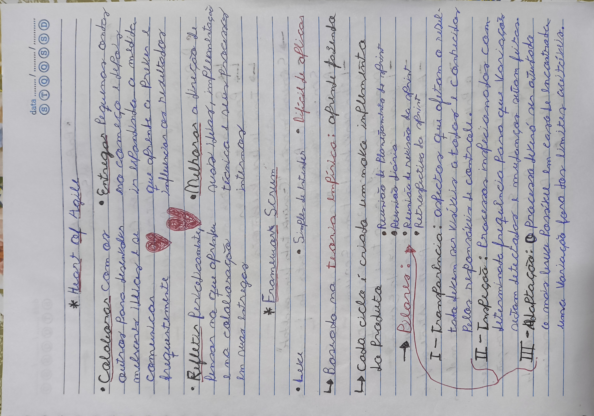
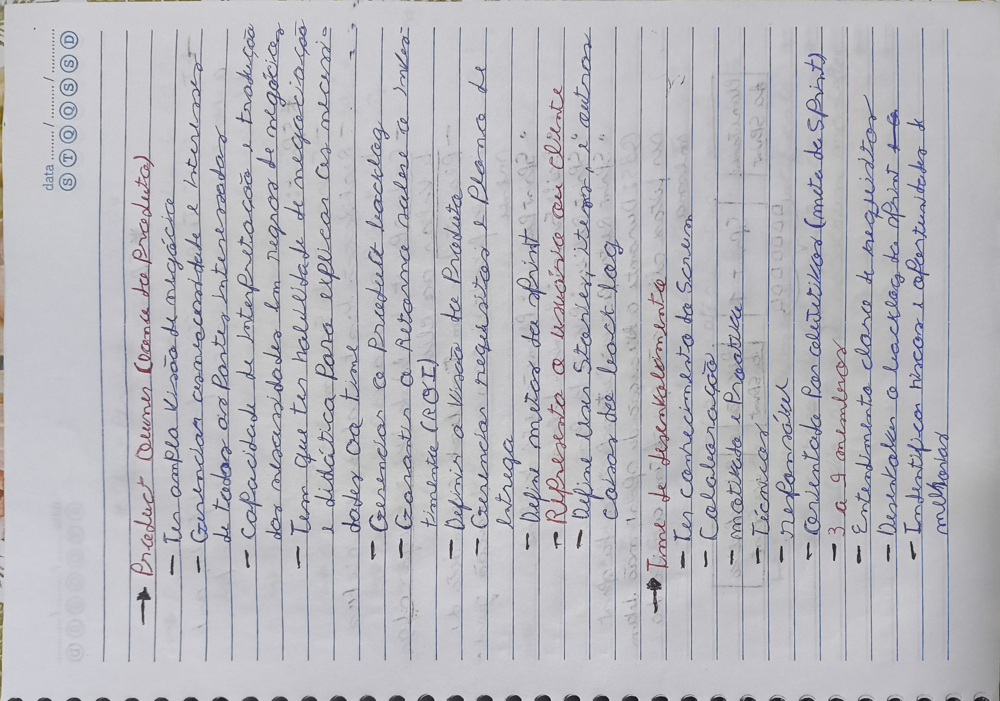
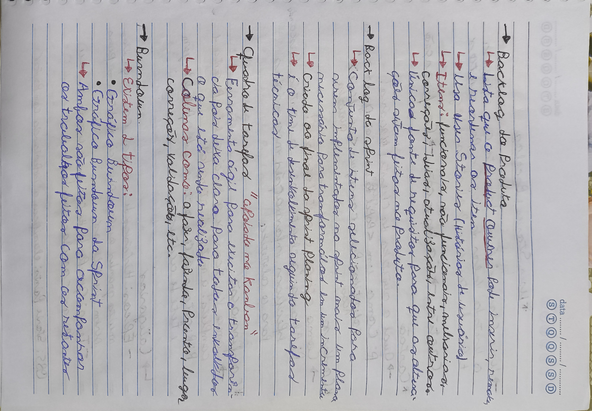

# METODOLOGIAS ÁGEIS
## SCRUM E KANBAN NA PRÁTICA

> Nesse resumo de anotações, irei apresentar o que fiz e aprendi no curso **"Como fazer Metodologias Ágeis – Scrum e Kanban na Prática"**.

*OBS: A estrutura seguirá tópicos pré-definidos que serão apresentados na sequência. Os trechos serão acompanhados por imagens digitalizadas das minhas anotações no caderno. Essas imagens não estarão necessariamente associadas aos tópicos, mas sim aos trechos escritos acima delas.*

---

- ### Tópicos
1. Identificando ambientes

   1.1 Framework Cynefin

   1.2 Medição de risco

2. Fundamentos do Scrum

3. Manifesto Ágil

   3.1 Valores do manifesto

   3.2 Princípios do manifesto

4. Conceitos de agilidade

    4.1 Modelo Cascata

    4.2 Modelo Ágil

    4.3 Ser Ágil e Fazer Ágil

5. Heart of Agile

6. Framework Scrum

    6.1 Características

    6.2 Pilares

7. Papéis e Responsabilidades Scrum

   7.1 Scrum Master

   7.2 Product Owner

   7.3 Time de desenvolvimento

8. Sprint

   8.1 Conceitos da Sprint Planing

   8.2 Conceitos da Daily Scrum

   8.3 Conceitos da Sprint Review

   8.4 Conceitos da Sprint Retrospective

9. Artefatos do Scrum

   9.1 Backlog do Produto

   9.2 Backlog da Sprint

   9.3 Quadro de tarefas

   9.4 Burndown

10. User Stories e Backlog

   10.1 Cartão, Conversa e Confirmação

   10.2 Categorias

   10.3 Visão de produto e construção de Backlog

11. Sprint na prática

   11.1 Sprint Planing na prática

   11.2 Daily Scrum na prática

   11.3 Definição de pronto

   11.4 Sprint Review na prática

   11.5 Sprint Retrospective na prática

12. Escalando o Scrum

---

<!-- Aqui começa o conteúdo -->
### 1. Identificando ambientes

#### 1.1 Framework Cynefin

O framework *Cynefin* obedece 4 categorias situacionais:

- Simples
- Complicado
- Complexo
- Caótico

O objetivo é indentificar onde cada situação se encaixa e buscar a melhorar até que _suba de categoria_ para se encontrar na categoria **simples**, seguindo a ordem:

*Caótico -> Complexo -> Complicado -> Simples*

O nível caótico (comando) a situação requer: **AGE, sente e responde** pois não há relação de causa e efeito

Já no nível complexo e no nível complicado a causa e efeito começam a ter correlação, onde no complexo segue: **FAZ TESTE, sente, responde** e no complicado: **sente, ANALISA, e responde**.

No nível de maior aceitação, o simples, causa e efeito já são conhecidas e perceptíveis, o que leva a seguir o melhor processo: **sente, CATEGORIZA e responde**.

#### 1.2 Medição de risco

Utilizando o framework *Cynefin* para medir risco, temos as seguintes 3 situações:

1. Situação complexa
   - **DE ALTO RISCO:** Ninguém conhecido fez isso, é *imprevisível*

2. Situação complicada
   - **DE MÉDIO RISCO:** Alguém conhecido já fez, *não nós*

3. Situação simples
   - **DE BAIXO RISCO:** *Nós já fizemos várias vezes*

### 2. Fundamentos do Scrum

Os fundamentos do Scrum levam em conta *planejamento e execução*, sendo eles:

- **Planejamento**
  - Estratégia
  - Arquitetura de negócio
  - Arquitetura de informática
  - Arquitetura de aplicação
  - Arquitetura tecnológica

- **Execução**
  - Métodos ágeis: _Scrum, XP, Crystal, entre outros_

Seguindo o framework de *Cynefin*, falado no tópico anterior, temos a seguinte distribuição:
- Caóticos: _SOBREVIVÊNCIA_
- *Complexos: Scrum, Kanban, e outros frameworks ágeis*
- Complicados e simples: _MÉTODOS PREDITIVOS_

### 3. Manifesto Ágil

O *Manifesto Ágil*, criado em 2001 por um grupo de 17 desenvolvedores de software, propôs um novo modo de trabalhar que prioriza a colaboração, a flexibilidade e a **entrega de valor contínua em intevalos regulares ao cliente**.

> "A prática do desenvolvimento ágil é sobre colocar a qualidade e o valor do cliente acima de tudo." (BECK, 2001)

#### 3.1 Valores do manifesto

Os 4 *valores* do manifesto são:

1. Indivíduos e interações **mais que** processos e ferramentas
2. Software em funcionamento **mais que** documentação extensiva
3. Colaboração com o cliente **mais que** negociação de contratos
4. Responder a mudanças **mais que** seguir um plano

#### 3.2 Princípios do manifesto

Os 12 *princípios* do manifesto são:

1. **Satisfação do cliente**
2. **Mudanças são bem-vindas**
3. **Entrega frequente**
4. **Colaboração diária**
5. **Motivação**
6. **Comunicação cara a cara**
7. **Software funcionando como medida de progresso**
8. **Desenvolvimento sustentável**
9. **Excelência técnica**
10. **Simplicidade**
11. **Auto-organização**
12. **Reflexão e adaptação**

### 4. Conceitos de agilidade

#### 4.1 Modelo cascata

O modelo de cascata é caracterizado por uma *abordagem sequencial* em que as fases do desenvolvimento que são executadas uma após a outra, sem voltar a fases anteriores.

EXEMPLO: **Estudo -> Análise -> Projeto -> Codificação -> Testes -> Implantação**

Por isso ele é considerado um *modelo preditivo* já que tem planejamento detalhado, estrutura fixa e mudanças planejadas.

#### 4.2 Modelo ágil

Já o modelo ágil, diferente do de cascata, tem:
- Flexibilidade
- **Entregas curtas e Interativas**

O foco desse modelo não é seguir uma linha até o final do projeto e entregar o produto final ao cliente. O foco é fazer *entregas incrementais* ao produto após processos com intervalos iguais chamados de **SPRINT**

#### 4.3 Ser ágil e fazer ágil

**Ser ágil** é um mindset a se seguir, junto com os 4 valores e os 12 princípios apresentados pelo *manifesto ágil*

**Fazer ágil** é seguir um framework como *scrum e kanban*

> "Agilidade é a capacidade de mover e mudar de direção, com rapidez e facilidade." (HIGHSMITH, 2001)

### 5. Heart of Agile

*Heart of Agile* segue 4 conceitos:

1. **Colaborar** com os outros e se comunicar frequentemente
2. **Entregar** pequenas ondas no começo e ir expandindo
3. **Refletir** periodicamente sobre as suas colaborações e entregas
4. **Melhorar** suas idéias, implementação técnica e processos internos

### 6. Framework Scrum

#### 6.1 Características

O framework *Scrum* é:
- Leve
- Simples de entender
- **DIFÍCIL DE APLICAR**

Isso por que é baseado na _teoria empírica_: **aprenda fazendo**

#### 6.2 Pilares

Scrum segue os seguintes pilares: **Trânsparência, Inspeção e Adaptação**

O primeiro pilar, transparência, requer que os *resultados sejam visíveis por todos*, sem segredos na equipe

Já os demais pilares, inspeção e adaptação, estão relacionados diretamente ao processo das *sprints*, especificamente as **reuniões realizadas em sua extensão**.

### 7. Papéis e Responsabilidades Scrum

#### 7.1 Scrum Master

O **Scrum Master** é o facilitador da equipe no método ágil Scrum, responsável por organizar e conduzir reuniões, incentivar a comunicação e colaboração dentro da equipe e da organização, assegurando que a equipe opere de maneira **eficiente** e alinhada aos princípios ágeis e muitas outras ações que se liguem a esse papel de "liderança".

#### 7.2 Product Owner

O **Product Owner** é a pessoa responsável por maximizar o *valor do produto* resultante do trabalho da equipe Scrum, atuando como a principal ponte entre os stakeholders e a equipe de desenvolvimento, sendo encarregado de gerenciar o **backlog do produto**, assegurando que o produto entregue atenda às necessidades do mercado e esteja sempre alinhado às prioridades do negócio.

#### 7.3 Time de desenvolvimento

O **Time de Desenvolvimento** é formado por profissionais multifuncionais que trabalham juntos para entregar incrementos de produto, transformando itens do **backlog** em funcionalidades prontas, com autonomia para decidir como realizar o trabalho, colaborando com o **Scrum Master** e o **Product Owner**, garantindo que cada entrega agregue valor ao cliente.

### 8. Sprint

A sprint, como falado anteriormente, é um processo que ao final dele, uma **meta pré definida** é atingida e um **incremento** é adicionado ao produto, agregando valor ao cliente

Assim como as reuniões que serão faladas a seguir, a sprint também tem um **tempo máximo de duração fixo**, chamado de _timebox_.

Normalmente o timebox de cada sprint é de *1 a 4 semanas*

#### 8.1 Conceitos da Sprint Planing

Reunião realizada **no primeiro dia da sprint**

- *Timebox:* 8 horas
- _Product owner_ define a **meta** da sprint
- É selecionado itens da *Backlog* para compor a *Sprint backlog*
- São criadas *tasks* nos itens selecionados

#### 8.2 Conceitos da Daily Scrum

Reunião realizada **todos os dias** durante a sprint

- *Timebox:* 15 minutos
- Encontro do _time de desenvolvimento_ para falar sobre os trabalhos realizados, a serem realizados no dia e se há impedimentos

#### 8.3 Conceitos da Sprint Review

Reunião realizada **ao final da sprint** para a inspeção do *incremento8 finalizado

- *Timebox:* 4 horas
- Momento para apresentar o incremento e avaliar se foram entregues todos os itens determinados

#### 8.4 Conceitos da Sprint Retrospective

Reunião feita **também ao final da sprint**, mas, diferentemente da review que foca no produto, a retrospective foca no processo de Scrum realizado

- *Timebox:* 3 horas
- Debater *mudanças, permanências e exclusão* de comportamentos, técnicas, ferramentas ou peculiaridades ocorridas durante a sprint

### 9. Artefatos do Scrum

os chamados **artefatos do scrum** são:
- Backlog do produto
- Backlog da versão de entrega (O que já foi entregue com os incrementos)
- Backlog da sprint
- Quadro de tarefas
- Burndown

#### 9.1 Backlog do Produto

> Lista que o PO (product Owner) pode inserir, remover e reordenar itens a partir das histórias de usuário (users stories)

#### 9.2 Backlog da Sprint

> Conjunto de itens selecionados no backlog do produto durante a Sprint Planing para gerar o incremento ao final da Sprint

#### 9.3 Quadro de tarefas

> Ferramentas de coluna, próximo ao que é o kanban, que contém as tarefas organizadas em colunas como "a fazer", "fazendo", "feitas"

#### 9.4 Burndown

> Gráfico que compara o que foi planejado fazer e o que foi feito, para se ter uma idéia de desempenho

### 10. User Stories e Backlog

**User Stories** é um formato que expressa o desejado valor do nogócio para muitos tipos de itens do **backlog**

Em outras palavras, é como o _product owner_ monta o backlog.

#### 10.1 Cartão, Conversa e Confirmação

**CARTÃO**: qual o objetivo do usuário?
**CONVERSA**: como atingir a meta e o objetivo?
**CONFIRMAÇÃO**: como verificar se a história está pronta e completa?

seguindo esses passos, o _product owner_ consegue construir um item.

#### 10.2 Categorias

*Categorias* que podem ser adicionadas aos itens:

- **ÉPICOS** é uma história de usuário muito grande ou faltando detalhes

- **TEMA** é um conjunto de história de usuário ou épicos que se *correlacionam diretamente*

#### 10.3 Visão de produto e construção de Backlog

**A visão de produtos** descreve de maneira clara e objetiva a meta da fase e as suas principais realizações

**Já a construção do backlog** requer entrevistas, dinâmicas em grupos, questionários e outras técnicas para ser feita

### 11. Sprint na prática

#### 11.1 Sprint Planing na prática

Divide o *timebox por 2*, para duas etapas:

1. **O que? - 4 horas**
   - Backlog é organizado enquanto o PO tira dúvidas, o time estima o tempo de cada item e a meta da sprint é definida.

2. **Como? - 4 horas**
   - Quebra itens em tarefas e estima-as

#### 11.2 Daily Scrum na prática

Cada membro do time responde **3 perguntas**:

1. *O que fez?*
2. *O que vai fazer?*
3. *Tem algum impedimento?*

em caso de ter algum impedimento, **após a reunião** a equipe se dedica em resolver.

#### 11.3 Definição de pronto

Para falar que a Sprint terminou:

- **Um incremento deve estar pronto**
- Boa qualidade para ser utilizado
- Todos os individuos devem concordar e entender o incremento

#### 11.4 Sprint Review na prática

A importância dessa reunião pós Sprint é **O PRODUTO**

- Itens devem ser demonstrados
- O backlog do produto deve ser atualizado
- Deve ser feito um monitoramento do progresso do produto

#### 11.5 Sprint Retrospective na prática

Já essa reunião pós sprint discute **O PROCESSO**

- Propostas de melhoria
- O que deve ser mantido para a próxima sprint e o que não pode se repetir

### 12. Escalando o Scrum

Para escalar o scrum, seria feito o processo chamado de **Scrum of Scrums** onde iriam haver várias equipes trabalhando em scrum, com cada uma com seus própios artefatos e Scrum masters (podem ser 1 PO para 2 equipes).

Podem haver reuniões como *"daily geral"* com representantes das equipes e papéis de **"chefes"**, seja de scrum master ou de PO, para gerir os grupos.

